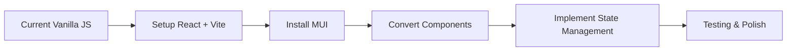
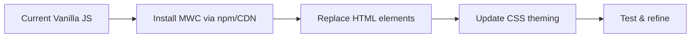
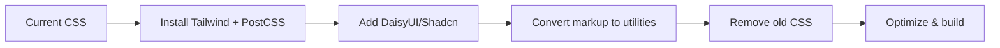
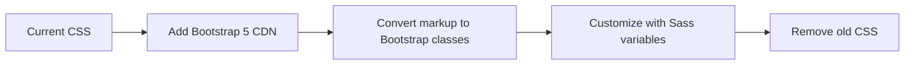

# Design Modernization Options for RTO Compliance Checker

## Executive Summary

Your current application uses vanilla JavaScript with custom CSS. You have several options for modernization, ranging from minimal CSS improvements to a full React + Material UI rewrite. This document analyzes each option with effort estimates, pros/cons, and specific recommendations.

---

## Current State Analysis

### Strengths
✅ Clean, maintainable vanilla JavaScript  
✅ Good separation of concerns  
✅ Dark/light theme support  
✅ Responsive design basics  
✅ No build step required  
✅ Fast load times  

### Weaknesses
❌ Basic visual design (2020-era styling)  
❌ Limited component reusability  
❌ Manual DOM manipulation  
❌ Inconsistent spacing and typography  
❌ Basic animations and transitions  
❌ No design system consistency  

---

## Option 1: Material UI (React)

### Overview
Complete rewrite to React with Material UI (MUI) component library.

### Implementation Effort
**Estimated Time:** 40-60 hours  
**Complexity:** High  
**Risk:** High  

### Pros
✅ **World-class component library** - 2000+ icons, every component you need  
✅ **Consistent design system** - Google's Material Design 3  
✅ **Excellent TypeScript support**  
✅ **Rich ecosystem** - Date pickers, data grids, charts  
✅ **Built-in accessibility** - WCAG compliant  
✅ **Professional appearance** - Used by Google, Netflix, NASA  
✅ **Strong community** - 90k+ GitHub stars, active development  
✅ **Advanced theming** - CSS-in-JS with emotion  
✅ **Responsive by default** - Built-in breakpoints and grid system  

### Cons
❌ **Complete rewrite required** - Rewrite all components in React  
❌ **Build system needed** - Webpack/Vite, babel, etc.  
❌ **Large bundle size** - 300-400kb minified (can be optimized)  
❌ **Learning curve** - Team needs React + MUI knowledge  
❌ **Runtime overhead** - React reconciliation  
❌ **Breaking changes** - Current architecture completely replaced  
❌ **Cost** - MUI X (advanced components) requires license ($15-49/dev/month)  

### Migration Path


### Code Example
```jsx
// Before (Vanilla JS)
<div class="scanner-card">
  <h2>Website Compliance Scanner</h2>
  <form id="scan-form">
    <input type="url" id="url-input" />
    <button type="submit">Scan</button>
  </form>
</div>

// After (React + MUI)
import { Card, CardContent, TextField, Button } from '@mui/material';

function ScannerCard() {
  const [url, setUrl] = useState('');
  
  return (
    <Card elevation={3}>
      <CardContent>
        <Typography variant="h5" gutterBottom>
          Website Compliance Scanner
        </Typography>
        <Box component="form" onSubmit={handleScan}>
          <TextField 
            fullWidth
            variant="outlined"
            label="URL"
            value={url}
            onChange={(e) => setUrl(e.target.value)}
          />
          <Button variant="contained" type="submit">
            Scan Website
          </Button>
        </Box>
      </CardContent>
    </Card>
  );
}
```

### Recommendation Score: 6/10
**Use if:** You want the absolute best component library and plan significant future feature development

---

## Option 2: Material Web Components (MWC)

### Overview
Use Google's Material Web Components - works with vanilla JavaScript, no framework needed.

### Implementation Effort
**Estimated Time:** 15-25 hours  
**Complexity:** Medium  
**Risk:** Medium  

### Pros
✅ **No framework required** - Works with vanilla JS  
✅ **Official Material Design** - From Google's design team  
✅ **Web standards based** - Custom elements, shadow DOM  
✅ **Good performance** - Lighter than React  
✅ **Progressive enhancement** - Can migrate gradually  
✅ **Modern appearance** - Material Design 3 components  
✅ **Framework agnostic** - Use with any or no framework  

### Cons
❌ **Smaller ecosystem** - Fewer components than MUI  
❌ **Less mature** - Still evolving (currently Material 3)  
❌ **Limited documentation** - Not as comprehensive as MUI  
❌ **Browser support** - Requires modern browsers  
❌ **Styling complexity** - CSS custom properties for theming  
❌ **No advanced components** - No data grid, date picker complexity  

### Migration Path


### Code Example
```html
<!-- After (Material Web Components) -->
<script type="module">
  import '@material/web/button/filled-button.js';
  import '@material/web/textfield/outlined-text-field.js';
  import '@material/web/card/outlined-card.js';
</script>

<md-card>
  <div class="card-content">
    <h2>Website Compliance Scanner</h2>
    <form id="scan-form">
      <md-outlined-text-field 
        label="Enter URL"
        type="url"
        required
      ></md-outlined-text-field>
      <md-filled-button type="submit">
        Scan Website
      </md-filled-button>
    </form>
  </div>
</md-card>
```

### Recommendation Score: 7/10
**Use if:** You want Material Design without React, keeping vanilla JS architecture

---

## Option 3: Tailwind CSS + DaisyUI/Shadcn

### Overview
Modern utility-first CSS framework with pre-built component library.

### Implementation Effort
**Estimated Time:** 12-20 hours  
**Complexity:** Low-Medium  
**Risk:** Low  

### Pros
✅ **Utility-first approach** - Rapid development  
✅ **Excellent documentation** - Best-in-class docs  
✅ **Works with vanilla JS** - No framework required  
✅ **Highly customizable** - Easy theming  
✅ **Small bundle size** - Only includes used classes  
✅ **Modern design patterns** - Contemporary look  
✅ **Great DX** - IntelliSense, plugins  
✅ **Component libraries** - DaisyUI, Flowbite, Shadcn  
✅ **Active community** - 77k+ GitHub stars  

### Cons
❌ **Verbose HTML** - Many class names  
❌ **Build step required** - PostCSS, purging  
❌ **Initial setup** - Configuration needed  
❌ **Learning curve** - New mental model  
❌ **Not a component library** - Build components yourself  

### Migration Path


### Code Example
```html
<!-- After (Tailwind + DaisyUI) -->
<div class="card bg-base-100 shadow-xl">
  <div class="card-body">
    <h2 class="card-title text-2xl font-bold">
      Website Compliance Scanner
    </h2>
    <form class="space-y-4">
      <input 
        type="url" 
        placeholder="https://your-college.edu.au"
        class="input input-bordered w-full"
      />
      <button class="btn btn-primary w-full">
        Scan Website
      </button>
    </form>
  </div>
</div>
```

### Recommendation Score: 8/10
**Use if:** You want modern design quickly without learning React, prefer utility classes

---

## Option 4: Bootstrap 5

### Overview
Updated Bootstrap with modern components and no jQuery dependency.

### Implementation Effort
**Estimated Time:** 10-15 hours  
**Complexity:** Low  
**Risk:** Very Low  

### Pros
✅ **Minimal learning curve** - Widely known framework  
✅ **Comprehensive components** - Everything needed  
✅ **Excellent documentation** - Years of refinement  
✅ **Works with vanilla JS** - Optional Bootstrap JS  
✅ **Battle-tested** - Used by millions  
✅ **Quick implementation** - Fast to get professional results  
✅ **Responsive by default** - Mobile-first design  
✅ **CDN available** - No build step required  

### Cons
❌ **Generic look** - "Bootstrap" appearance  
❌ **Less modern** - Not as cutting-edge as Tailwind  
❌ **Heavier bundle** - More CSS than needed  
❌ **Less customizable** - Harder to make unique  
❌ **Class proliferation** - Many utility classes  

### Migration Path


### Code Example
```html
<!-- After (Bootstrap 5) -->
<div class="card shadow">
  <div class="card-body">
    <h2 class="card-title h4 mb-3">
      Website Compliance Scanner
    </h2>
    <form>
      <div class="mb-3">
        <input 
          type="url" 
          class="form-control" 
          placeholder="https://your-college.edu.au"
        />
      </div>
      <button class="btn btn-primary w-100">
        Scan Website
      </button>
    </form>
  </div>
</div>
```

### Recommendation Score: 7/10
**Use if:** You want fast results with familiar technology, don't need cutting-edge design

---

## Option 5: Modern CSS Improvements (Pure CSS)

### Overview
Enhance current CSS with modern patterns, no framework.

### Implementation Effort
**Estimated Time:** 8-12 hours  
**Complexity:** Low  
**Risk:** Very Low  

### Pros
✅ **Zero dependencies** - No frameworks  
✅ **Keep current architecture** - Minimal changes  
✅ **Full control** - Custom everything  
✅ **Small bundle size** - Only what you write  
✅ **No build step** - Direct CSS  
✅ **Progressive enhancement** - Improve gradually  
✅ **Learning opportunity** - Master modern CSS  

### Cons
❌ **Manual work** - Build everything yourself  
❌ **Time consuming** - Slower than frameworks  
❌ **Less consistency** - No design system  
❌ **Maintenance burden** - All custom code  
❌ **Limited components** - No pre-built library  

### What to Improve
- Add CSS animations with `@keyframes`
- Use CSS Grid for complex layouts
- Implement CSS custom properties for theming
- Add glassmorphism effects
- Use CSS filters and backdrop-filter
- Implement better shadows and depth
- Add smooth state transitions
- Use CSS containment for performance
- Implement container queries

### Code Example
```css
/* Modern CSS improvements */
.scanner-card {
  background: rgba(255, 255, 255, 0.95);
  backdrop-filter: blur(10px);
  border: 1px solid rgba(255, 255, 255, 0.2);
  border-radius: 16px;
  box-shadow: 
    0 10px 30px -15px rgba(0, 0, 0, 0.2),
    0 20px 40px -20px rgba(0, 0, 0, 0.15);
  transition: transform 0.3s ease, box-shadow 0.3s ease;
  container-type: inline-size;
}

.scanner-card:hover {
  transform: translateY(-2px);
  box-shadow: 
    0 15px 40px -15px rgba(0, 0, 0, 0.25),
    0 25px 50px -20px rgba(0, 0, 0, 0.2);
}

/* Modern gradient button */
.btn-primary {
  background: linear-gradient(
    135deg,
    var(--primary-color),
    var(--secondary-color)
  );
  position: relative;
  overflow: hidden;
}

.btn-primary::before {
  content: '';
  position: absolute;
  inset: 0;
  background: linear-gradient(
    135deg,
    rgba(255, 255, 255, 0.2),
    transparent
  );
  opacity: 0;
  transition: opacity 0.3s;
}

.btn-primary:hover::before {
  opacity: 1;
}

/* Smooth animations */
@keyframes slideUp {
  from {
    opacity: 0;
    transform: translateY(20px);
  }
  to {
    opacity: 1;
    transform: translateY(0);
  }
}

.results-section {
  animation: slideUp 0.5s cubic-bezier(0.4, 0, 0.2, 1);
}
```

### Recommendation Score: 6/10
**Use if:** You want to keep vanilla JS and improve incrementally with full control

---

## Option 6: Open-Props + Minimal Framework

### Overview
Use Open-Props for design tokens with a lightweight component approach.

### Implementation Effort
**Estimated Time:** 10-15 hours  
**Complexity:** Low  
**Risk:** Low  

### Pros
✅ **Comprehensive design tokens** - 550+ CSS custom properties  
✅ **Works with vanilla JS** - No framework required  
✅ **Modern design patterns** - Contemporary aesthetics  
✅ **Small footprint** - ~7kb gzipped  
✅ **Easy to customize** - Just CSS variables  
✅ **Great animations** - Pre-built easing functions  
✅ **Accessibility focus** - Motion preferences, focus states  

### Cons
❌ **Not a complete solution** - Just tokens, not components  
❌ **Still need to build UI** - No pre-made components  
❌ **Less known** - Smaller community  
❌ **Manual integration** - More setup work  

### Code Example
```css
@import "open-props/style";
@import "open-props/normalize";

.scanner-card {
  background: var(--surface-1);
  border-radius: var(--radius-3);
  box-shadow: var(--shadow-3);
  padding: var(--size-fluid-3);
  transition: 
    box-shadow var(--ease-3) var(--speed-2),
    transform var(--ease-3) var(--speed-2);
}

.scanner-card:hover {
  box-shadow: var(--shadow-5);
  transform: translateY(var(--size-1));
}

.btn-primary {
  background: var(--gradient-8);
  padding: var(--size-2) var(--size-4);
  border-radius: var(--radius-2);
  font-size: var(--font-size-2);
  font-weight: var(--font-weight-6);
}
```

### Recommendation Score: 7/10
**Use if:** You want professional design tokens without a full framework

---

## Comparison Matrix

| Option | Effort | Visual Impact | Learning Curve | Bundle Size | Customization | Maintenance | Total Score |
|--------|--------|---------------|----------------|-------------|---------------|-------------|-------------|
| **Material UI (React)** | 40-60h | ⭐⭐⭐⭐⭐ | High | ~400kb | Medium | Medium | ⭐⭐⭐ (6/10) |
| **Material Web Components** | 15-25h | ⭐⭐⭐⭐ | Medium | ~150kb | Medium | Low | ⭐⭐⭐⭐ (7/10) |
| **Tailwind + DaisyUI** | 12-20h | ⭐⭐⭐⭐⭐ | Medium | ~50kb | High | Low | ⭐⭐⭐⭐ (8/10) |
| **Bootstrap 5** | 10-15h | ⭐⭐⭐⭐ | Low | ~150kb | Medium | Low | ⭐⭐⭐⭐ (7/10) |
| **Modern CSS Only** | 8-12h | ⭐⭐⭐ | Low | ~30kb | High | High | ⭐⭐⭐ (6/10) |
| **Open-Props** | 10-15h | ⭐⭐⭐⭐ | Low | ~7kb | High | Medium | ⭐⭐⭐⭐ (7/10) |

---

## Recommended Approach: Phased Implementation

### 🏆 Best Overall: Tailwind CSS + DaisyUI

**Why this wins:**
1. **Modern, professional look** - Matches 2024 design trends
2. **Works with vanilla JS** - No architectural rewrite
3. **Fast implementation** - 12-20 hours for full redesign
4. **Excellent DX** - Great tooling and documentation
5. **Small bundle size** - ~50kb after purging
6. **Easy maintenance** - Utility classes are intuitive
7. **Future-proof** - Can add React later if needed

### Implementation Phases

#### Phase 1: Setup & Foundation (2-3 hours)
- [ ] Install Tailwind CSS and PostCSS
- [ ] Add DaisyUI plugin
- [ ] Configure theme colors
- [ ] Set up build process
- [ ] Create new HTML template

#### Phase 2: Core Components (6-8 hours)
- [ ] Redesign header with gradient
- [ ] Modernize scanner card
- [ ] Style form inputs
- [ ] Redesign buttons with animations
- [ ] Update loading states
- [ ] Improve modal design

#### Phase 3: Results & Polish (4-6 hours)
- [ ] Redesign results section
- [ ] Style violation cards
- [ ] Add smooth transitions
- [ ] Implement toast notifications
- [ ] Mobile responsiveness
- [ ] Dark theme refinement

#### Phase 4: Advanced Features (2-3 hours)
- [ ] Add micro-interactions
- [ ] Implement scroll animations
- [ ] Add progress indicators
- [ ] Polish edge cases
- [ ] Performance optimization

---

## Budget Breakdown by Option

### Material UI (React)
- **Developer Time:** 40-60 hours @ $100/hr = $4,000-$6,000
- **MUI X License:** $15-49/month (if needed)
- **Total:** $4,000-$6,000 + ongoing licensing

### Tailwind + DaisyUI (Recommended)
- **Developer Time:** 12-20 hours @ $100/hr = $1,200-$2,000
- **Tools:** Free and open source
- **Total:** $1,200-$2,000 (one-time)

### Bootstrap 5
- **Developer Time:** 10-15 hours @ $100/hr = $1,000-$1,500
- **Tools:** Free and open source
- **Total:** $1,000-$1,500 (one-time)

### Modern CSS Only
- **Developer Time:** 8-12 hours @ $100/hr = $800-$1,200
- **Tools:** None required
- **Total:** $800-$1,200 (one-time)

---

## Final Recommendation

### 🎯 Primary Recommendation: **Tailwind CSS + DaisyUI**

**Rationale:**
1. **Best ROI** - Professional results in 12-20 hours
2. **Modern design** - 2024 design trends without React rewrite
3. **Maintainable** - Utility classes are intuitive and well-documented
4. **Flexible** - Can migrate to React later if business needs change
5. **Performance** - Small bundle, fast load times
6. **Community** - Huge ecosystem, active support

### 🥈 Alternative: **Material Web Components**

**Use if:** You specifically want Material Design and Google's official components without React.

### ⚠️ Don't Choose Material UI Unless:
- You plan to hire React developers
- You need advanced MUI X components (data grids, date pickers)
- You're building a complex dashboard application
- You have 40-60 hours to invest in migration

---

## Next Steps

1. **Decision Making** - Choose your approach based on priorities
2. **Proof of Concept** - Build one screen with chosen framework
3. **Team Review** - Validate the approach with stakeholders
4. **Full Implementation** - Roll out across all screens
5. **Testing** - Ensure responsiveness and accessibility
6. **Documentation** - Update style guide

---

## Resources

### Tailwind CSS + DaisyUI
- [Tailwind Docs](https://tailwindcss.com)
- [DaisyUI Components](https://daisyui.com)
- [Tailwind UI](https://tailwindui.com) - Premium components

### Material Web Components
- [Material Web](https://github.com/material-components/material-web)
- [Getting Started Guide](https://material-web.dev)

### Material UI (React)
- [MUI Docs](https://mui.com)
- [Migration Guide](https://mui.com/material-ui/migration/migration-v4/)

### Open-Props
- [Open-Props](https://open-props.style)
- [Demos & Examples](https://open-props.style/#demos)

---

## Questions?

**Need a working prototype?** I can create a sample page with any of these approaches so you can see the actual results before committing.

**Want specific component examples?** I can show exactly how your scanner card, results display, or any other component would look with each approach.

**Concerned about migration complexity?** I can create a detailed step-by-step migration guide for your chosen approach.